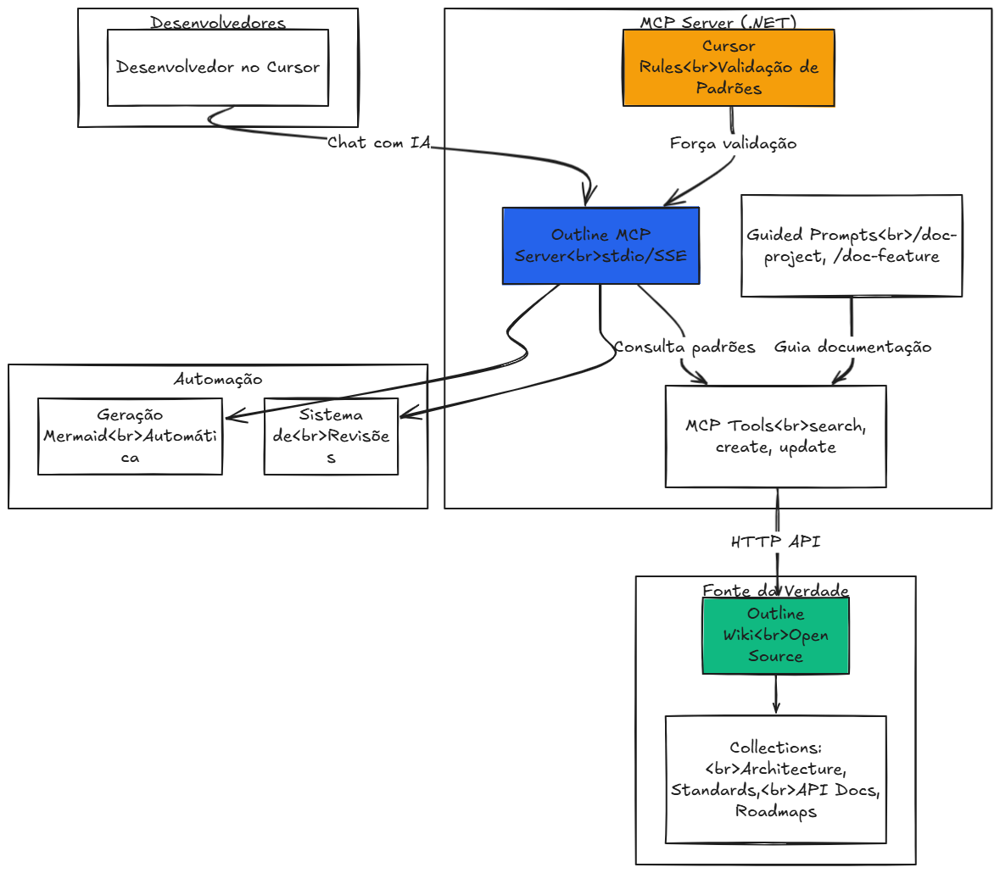

# Outline MCP Integration

**Integração do Model Context Protocol (MCP) com Outline para gerenciamento automatizado de documentação via AI agents.**

**Autor:** Lucas Rocha de Moraes ([@datasuricata](https://github.com/datasuricata))

## O que é?

MCP Server em C# que conecta Cursor/Claude Desktop ao Outline, permitindo que AI agents:
- Criem e atualizem documentação automaticamente
- Busquem e recuperem documentos
- Gerenciem revisões e histórico
- Gerem diagramas Mermaid
- Executem workflows guiados com guardrails anti-genérico

## Arquitetura do Sistema



O diagrama acima ilustra como os componentes interagem: desenvolvedores usam o Cursor IDE que se comunica com o MCP Server (.NET), que aplica regras de validação e fornece ferramentas para gerenciar a documentação no Outline Wiki (fonte de verdade).

## Quick Start

Escolha o método de instalação:

| Método | Requer .NET | Setup | Ideal para |
|--------|-------------|-------|------------|
| **[Executável](./QUICKSTART.md#opção-1a-mcp-server-self-contained-recomendado---sem-net-sdk)** | Não | 5 min | Usuários finais |
| **[Docker SSE](./QUICKSTART.md#opção-3-mcp-server-remoto-dockersse)** | Não | 10 min | Equipes/produção |
| **[.NET SDK](./QUICKSTART.md#opção-1b-mcp-server-com-net-sdk-desenvolvimento)** | Sim | 5 min | Desenvolvedores |

Ver guia completo: **[QUICKSTART.md](./QUICKSTART.md)**

## Opções de Deployment

### 1. Self-Contained Executable (Recomendado)
- **Tamanho:** ~70-100MB
- **Vantagens:** Não requer .NET SDK, fácil distribuição
- **Build:** `.\scripts\publish-win-x64.ps1`

### 2. Native AOT
- **Tamanho:** ~15-30MB (3x menor)
- **Vantagens:** Inicialização 10-100x mais rápida, menor memória
- **Build:** `.\scripts\publish-win-x64-aot.ps1`
- **Requisitos:** C++ build tools

### 3. Docker/SSE Remoto
- **Ideal para:** Equipes, múltiplos clientes
- **Setup:** `docker-compose up`

Ver detalhes: **[docs/setup/](./docs/setup/)**

## Ferramentas MCP

**Documentos:**
- `list_collections`, `search_documents`, `get_document`
- `create_document`, `update_document`, `delete_document`

**Revisões:**
- `list_revisions`, `get_revision`, `restore_revision`

**Prompts Guiados:**
- `/doc-project` - Documentar projeto completo
- `/doc-feature` - Documentar funcionalidade específica
- `/get-budget` - Criar proposta comercial com roadmap
- `/quick-start` - Bootstrap completo

Ver uso: **[docs/usage/](./docs/usage/)**

## Documentação

### Começar
- **[QUICKSTART.md](./QUICKSTART.md)** - Setup em 5 minutos

### Setup
- [Docker Local](./docs/setup/docker.md) - Instalar Outline via Docker
- [Executável](./docs/setup/executable.md) - Self-contained/Native AOT
- [Desenvolvimento](./docs/setup/development.md) - .NET SDK
- [SSE Remoto](./docs/setup/sse-remote.md) - Docker em produção

### Uso
- [CLI](./docs/usage/cli.md) - Comandos via terminal
- [MCP Tools](./docs/usage/mcp-tools.md) - Uso com Cursor/Claude
- [MCP Prompts](./docs/usage/mcp-prompts.md) - Workflows guiados
- [Revisões](./docs/usage/revisions.md) - Sistema de histórico

### Referência
- [Arquitetura](./docs/architecture.md) - Estrutura técnica
- [Troubleshooting](./docs/troubleshooting.md) - Resolver problemas

## Testes

```bash
# Todos os testes
dotnet test

# Apenas unitários
dotnet test --filter "FullyQualifiedName~Unit"
```

## Licença

MIT License

---

**Links Rápidos:**
[Quick Start](./QUICKSTART.md) •
[Setup](./docs/setup/) •
[Usage](./docs/usage/) •
[Architecture](./docs/architecture.md) •
[Troubleshooting](./docs/troubleshooting.md)