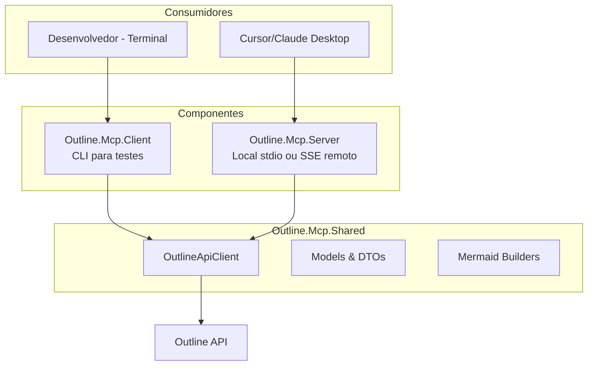
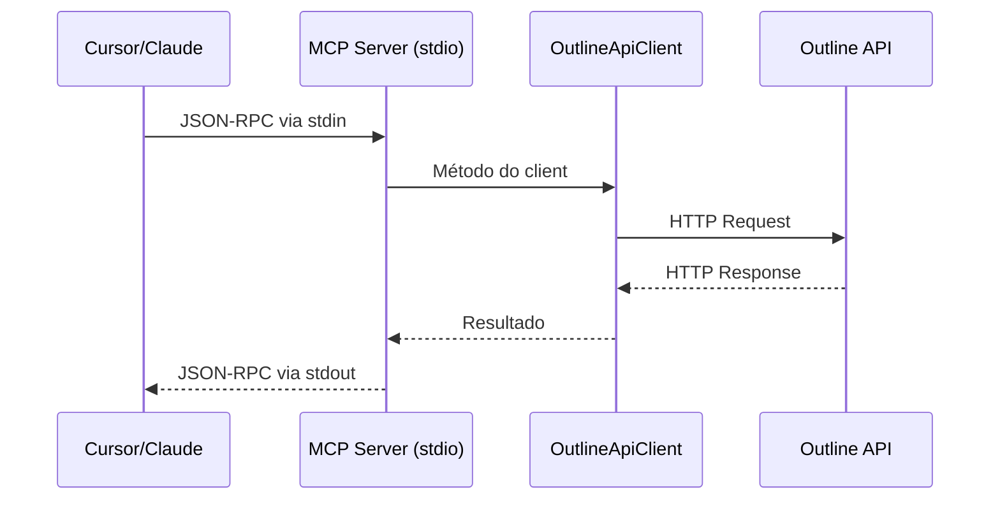
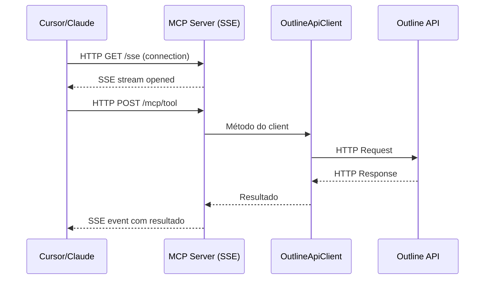

# Architecture - Outline MCP Integration

Documentação técnica da arquitetura e estrutura do projeto.

## Visão Geral

Este projeto fornece um MCP Server que expõe ferramentas para interagir com o Outline, permitindo que agentes AI como Cursor e Claude Desktop gerenciem documentação automaticamente. A integração suporta criação, busca, atualização e listagem de documentos, além de geração automática de diagramas Mermaid.

## Componentes Principais

### 1. Outline.Mcp.Server

**Responsabilidade:** Servidor MCP com suporte para stdio (local) e SSE (remoto).

**Localização:** `src/Outline.Mcp.Server/`

**Características:**
- Auto-detecção de modo (stdio vs SSE)
- Exposição de tools MCP
- Exposição de prompts MCP
- Logging estruturado (stderr para stdio, console para SSE)

**Entry Point:** `Program.cs`

```csharp
// Auto-detecção de modo
if (args.Contains("--stdio") || Console.IsInputRedirected)
{
    // Modo STDIO para Cursor/Claude Desktop
    await CreateStdioServer(builder);
}
else
{
    // Modo SSE para acesso HTTP
    await CreateSseServer(builder);
}
```

**Estrutura:**

```
Outline.Mcp.Server/
├── Program.cs               # Entry point com auto-detecção
├── Tools/                   # Ferramentas MCP
│   └── OutlineTools.cs      # Implementação das tools
├── Prompts/                 # Prompts MCP
│   ├── DocProjectPrompt.cs
│   ├── DocFeaturePrompt.cs
│   ├── GetBudgetPrompt.cs
│   ├── QuickStartPrompt.cs
│   └── OutlinePrompts.cs    # Base class
└── Dockerfile               # Container para modo SSE
```

### 2. Outline.Mcp.Client

**Responsabilidade:** CLI de teste e bootstrap.

**Localização:** `src/Outline.Mcp.Client/`

**Comandos:**
- `list-collections`
- `search`
- `get`
- `create`
- `update`
- `bootstrap`
- `list-revisions`
- `get-revision`
- `restore-revision`

**Estrutura:**

```
Outline.Mcp.Client/
├── Program.cs
└── Commands/
    ├── BootstrapCommand.cs  # Validação e setup inicial
    └── (outros commands)
```

### 3. Outline.Mcp.Shared

**Responsabilidade:** Código compartilhado entre Server e Client.

**Localização:** `src/Outline.Mcp.Shared/`

**Módulos:**

#### a) Models

DTOs para comunicação com Outline API:

```
Models/
├── OutlineCollection.cs     # Collection de documentos
├── OutlineDocument.cs       # Documento
├── OutlineRevision.cs       # Revisão de documento
├── OutlineRequest.cs        # Requests para API
└── OutlineResponse.cs       # Responses da API
```

#### b) API Client

Client HTTP com retry e polly:

```
Api/
├── IOutlineApiClient.cs     # Interface
└── OutlineApiClient.cs      # Implementação
```

**Features:**
- Retry automático com exponential backoff
- Timeout configurável
- Rate limiting handling

#### c) Mermaid Builders

Builders fluentes para diagramas:

```
Mermaid/
├── MermaidDiagramBuilder.cs      # Base builder
├── FlowchartBuilder.cs            # Fluxogramas
├── ClassDiagramBuilder.cs         # Diagramas de classe
├── SequenceDiagramBuilder.cs      # Diagramas de sequência
├── EntityRelationshipBuilder.cs   # Diagramas ER
├── MermaidDiagramType.cs          # Enum de tipos
└── MermaidHelpers.cs              # Helpers
```

**Exemplo de uso:**

```csharp
var diagram = new MermaidDiagramBuilder()
    .CreateFlowchart(FlowchartDirection.TopToBottom)
    .AddNode("start", "Início", NodeShape.RoundedRectangle)
    .AddNode("process", "Processar", NodeShape.Rectangle)
    .AddEdge("start", "process")
    .Build();

var markdown = MermaidHelpers.WrapInMarkdownCodeBlock(diagram);
```

## Diagrama de Arquitetura



## Modos de Deployment

### 1. Self-Contained

Executável único com todas as dependências.

**Tamanho:** ~70-100MB

**Vantagens:**
- ✅ Não requer .NET SDK
- ✅ Funcionamento garantido
- ✅ Fácil distribuição

**Geração:**

```bash
# Windows
.\scripts\publish-win-x64.ps1

# Linux
./scripts/publish-linux-x64.sh

# macOS
./scripts/publish-osx-arm64.sh
```

### 2. Native AOT

Compilação para código nativo.

**Tamanho:** ~15-30MB

**Vantagens adicionais:**
- Inicialização instantânea (10-100x mais rápido)
- Menor uso de memória (~50% menos)
- Mais difícil reverse engineering

**Requisitos:**
- Windows: Visual Studio com C++ tools
- Linux: `clang` e `zlib1g-dev`
- macOS: Xcode Command Line Tools

**Geração:**

```bash
# Windows
.\scripts\publish-win-x64-aot.ps1

# Linux
./scripts/publish-linux-x64-aot.sh

# macOS
./scripts/publish-osx-arm64-aot.sh
```

### 3. Tradicional (.NET SDK)

Requer .NET SDK 8.0 instalado.

**Tamanho:** ~5MB (DLL apenas)

**Quando usar:**
- Durante desenvolvimento
- Para debug e testes
- Quando .NET SDK já está instalado

**Execução:**

```bash
dotnet build
dotnet run --project src/Outline.Mcp.Server
```

## Comparação de Deployments

| Método | Tamanho | Inicialização | .NET Necessário | Uso |
|--------|---------|---------------|-----------------|-----|
| **Native AOT** | 15-30MB | Instantânea | ❌ Não | Produção |
| **Self-Contained** | 70-100MB | Normal | ❌ Não | Distribuição |
| **Tradicional** | ~5MB | Normal | ✅ Sim (.NET 8.0) | Desenvolvimento |

## Fluxo de Dados

### Modo Local (stdio)



### Modo Remoto (SSE)



## MCP Tools Implementation

### Tools Decorator

```csharp
[Tool(
    Name = "list_collections",
    Description = "Lista todas as collections disponíveis no Outline"
)]
public async Task<string> ListCollections()
{
    var collections = await _client.ListCollectionsAsync();
    return JsonSerializer.Serialize(collections);
}
```

### Parameter Decorator

```csharp
[Tool(Name = "search_documents")]
public async Task<string> SearchDocuments(
    [Parameter(Description = "Query de busca")] string query,
    [Parameter(Description = "Collection ID (opcional)")] string? collectionId = null,
    [Parameter(Description = "Limite de resultados")] int limit = 20)
{
    // Implementação
}
```

## MCP Prompts Implementation

### Prompt Decorator

```csharp
[Prompt(
    Name = "doc-project",
    Description = "Documentar estrutura e arquitetura de projeto"
)]
public class DocProjectPrompt : OutlinePrompts
{
    public override string GetPromptContent(Dictionary<string, object?> arguments)
    {
        // Lê template de skills/
        var template = ReadTemplate("project-documentation.md");
        
        // Injeta guardrails
        return $@"
## CRITICAL GUARDRAILS

⚠️ DO NOT create generic/placeholder content
⚠️ MUST read actual files from the workspace

## ROLE

You are a technical architect and scribe...

## TEMPLATE

{template}
";
    }
}
```

## Guardrails Implementation

Todos os prompts incluem guardrails que:

1. **Leem arquivos reais** do disco
2. **Proíbem conteúdo genérico**
3. **Forçam análise** do código
4. **Reportam erros** se arquivos não encontrados

**Implementação em `/quick-start`:**

```csharp
// Lê documentação do executável
var baseDir = AppContext.BaseDirectory;
var readmeContent = File.ReadAllText(Path.Combine(baseDir, "docs", "README.md"));
var setupContent = File.ReadAllText(Path.Combine(baseDir, "docs", "SETUP.md"));

// Embute conteúdo no prompt
var promptContent = $@"
## README.md Content
{readmeContent}

## SETUP.md Content
{setupContent}

⚠️ USE THIS REAL CONTENT - DO NOT CREATE GENERIC EXAMPLES
";
```

**Para Docker SSE:**

Dockerfile copia `docs/` e `skills/`:

```dockerfile
COPY ["docs/", "/app/publish/docs/"]
COPY ["skills/", "/app/publish/skills/"]
```

`.dockerignore` permite markdown:

```
!docs/**/*.md
!skills/**/*.md
```

## Testing Architecture

### Unit Tests

**Localização:** `tests/Outline.Mcp.Tests/Unit/`

**Cobertura:**
- Mermaid builders
- Mermaid helpers
- OutlineApiClient (mocked)

**Framework:** xUnit + Moq

### Integration Tests

**Localização:** `tests/Outline.Mcp.Tests/Integration/`

**Cobertura:**
- OutlineApiClient (real API)
- Create, update, delete workflows

**Requisitos:** Outline rodando + API key

## Embedded Resources Strategy

### Skills Templates

Para eliminar dependências de arquivos externos, as skills são embedded como recursos .NET:

**No `.csproj`:**

```xml
<ItemGroup>
  <EmbeddedResource Include="..\..\skills\project-documentation.md" />
  <EmbeddedResource Include="..\..\skills\feature-documentation.md" />
  <EmbeddedResource Include="..\..\skills\budget-proposal.md" />
</ItemGroup>
```

**Helper para leitura:**

```csharp
public static class EmbeddedResourceHelper
{
    public static string ReadEmbeddedResource(string resourceName)
    {
        var assembly = Assembly.GetExecutingAssembly();
        var fullName = assembly.GetManifestResourceNames()
            .FirstOrDefault(n => n.EndsWith(resourceName));
        
        using var stream = assembly.GetManifestResourceStream(fullName);
        using var reader = new StreamReader(stream);
        return reader.ReadToEnd();
    }
}
```

**Vantagens:**
- ✅ Zero dependências de arquivos externos
- ✅ Skills sempre disponíveis
- ✅ Builds mais rápidos (sem cópias)
- ✅ Distribuição simplificada (apenas o .exe)
- ✅ Dockerfile limpo (sem COPY de docs/skills)

## Build System

### Project Structure

```
Outline.Mcp.sln
├── src/
│   ├── Outline.Mcp.Server/
│   ├── Outline.Mcp.Client/
│   └── Outline.Mcp.Shared/
└── tests/
    └── Outline.Mcp.Tests/
```

### Dependencies

```xml
<!-- Outline.Mcp.Server -->
<PackageReference Include="ModelContextProtocol" Version="0.7.0-preview.1" />
<PackageReference Include="ModelContextProtocol.AspNetCore" Version="0.7.0-preview.1" />
<PackageReference Include="Polly" Version="8.6.5" />
<PackageReference Include="Serilog.Sinks.Console" Version="6.1.1" />

<!-- Outline.Mcp.Client -->
<PackageReference Include="Spectre.Console" Version="0.49.1" />

<!-- Outline.Mcp.Shared -->
<PackageReference Include="Polly" Version="8.6.5" />
```

### Build Targets

```bash
# Build completo
dotnet build

# Build Release
dotnet build -c Release

# Publish self-contained
dotnet publish -c Release --runtime win-x64 --self-contained

# Publish Native AOT
dotnet publish -c Release --runtime win-x64 /p:PublishAot=true
```

## Logging Strategy

### stdio Mode

Logs vão para **stderr** para não interferir com JSON-RPC em stdout:

```csharp
builder.Logging.AddConsole(options =>
{
    options.LogToStandardErrorThreshold = LogLevel.Trace;
});
```

### SSE Mode

Logs vão para **stdout** normalmente:

```csharp
builder.Logging.AddConsole();
```

## Error Handling

### Retry with Exponential Backoff

```csharp
var retryPolicy = Policy
    .Handle<HttpRequestException>()
    .WaitAndRetryAsync(
        retryCount: 3,
        sleepDurationProvider: attempt => TimeSpan.FromSeconds(Math.Pow(2, attempt)),
        onRetry: (exception, timeSpan, retryCount, context) =>
        {
            _logger.LogWarning("Retry {RetryCount} after {Delay}s", retryCount, timeSpan.TotalSeconds);
        });
```

### Rate Limiting Handling

```csharp
if (response.StatusCode == HttpStatusCode.TooManyRequests)
{
    var retryAfter = response.Headers.RetryAfter?.Delta ?? TimeSpan.FromSeconds(60);
    await Task.Delay(retryAfter);
    // Retry automaticamente
}
```

## Referências Técnicas

- [Model Context Protocol Specification](https://modelcontextprotocol.io/specification/)
- [MCP C# SDK](https://github.com/modelcontextprotocol/csharp-sdk)
- [MCP C# SDK Documentation](https://modelcontextprotocol.github.io/csharp-sdk/)
- [Outline API OpenAPI Spec](https://github.com/outline/openapi)
- [Mermaid Documentation](https://mermaid.js.org/)
- [Polly - Resilience Framework](https://github.com/App-vNext/Polly)

## Próximos Passos

- [Setup Guides](./setup/) - Instalação e configuração
- [Usage Guides](./usage/) - Guias de uso
- [Troubleshooting](./troubleshooting.md) - Resolução de problemas
