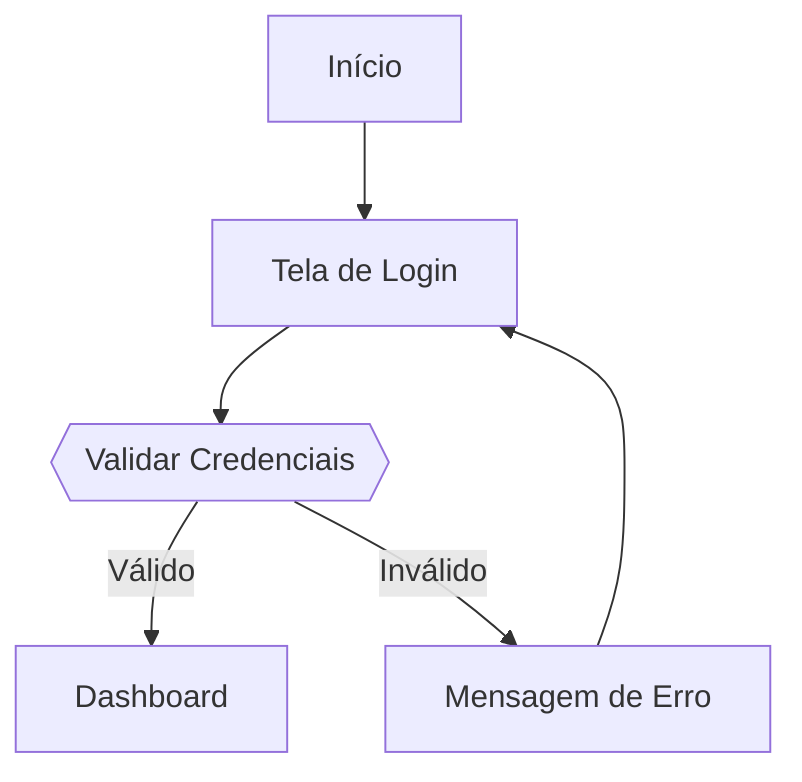

# CLI Usage Guide

Guia completo para usar a CLI do Outline MCP Integration.

## Pré-requisitos

- Outline instalado e rodando
- API Key configurada
- Variáveis de ambiente definidas:
  - `OUTLINE_BASE_URL`
  - `OUTLINE_API_KEY`

## Execução Básica

### Com Executável Self-Contained

```bash
# Windows
.\publish\win-x64\Outline.Mcp.Client.exe <command> [options]

# Linux/macOS
./publish/linux-x64/Outline.Mcp.Client <command> [options]
```

### Com .NET SDK

```bash
dotnet run --project src/Outline.Mcp.Client -- <command> [options]
```

## Comandos Disponíveis

### 1. list-collections

Lista todas as collections disponíveis.

```bash
dotnet run --project src/Outline.Mcp.Client -- list-collections
```

**Saída:**

```
┌──────────────────────────────────────┬─────────────┬─────────────────────┬──────┬────────────┐
│ ID                                   │ Name        │ Description         │ Icon │ Permission │
├──────────────────────────────────────┼─────────────┼─────────────────────┼──────┼────────────┤
│ abc-123-def-456                      │ Engineering │ Technical docs      │ TECH │ read_write │
│ ghi-789-jkl-012                      │ Marketing   │ Marketing content   │ MKT  │ read       │
└──────────────────────────────────────┴─────────────┴─────────────────────┴──────┴────────────┘

Found 2 collection(s)
```

### 2. search

Busca documentos por query.

**Busca simples:**

```bash
dotnet run --project src/Outline.Mcp.Client -- search --query "authentication"
```

**Busca em collection específica:**

```bash
dotnet run --project src/Outline.Mcp.Client -- search \
  --query "API" \
  --collection-id "abc-123-def-456"
```

**Com limite de resultados:**

```bash
dotnet run --project src/Outline.Mcp.Client -- search \
  --query "authentication" \
  --limit 5
```

**Saída:**

```
┌─────────┬──────────────────────────┬──────────────────────┬───────────────────────────────┐
│ Ranking │ Title                    │ ID                   │ Context                       │
├─────────┼──────────────────────────┼──────────────────────┼───────────────────────────────┤
│ 1.85    │ Authentication Guide     │ doc-001              │ Our authentication system...  │
│ 1.42    │ API Reference            │ doc-002              │ API endpoints for...          │
└─────────┴──────────────────────────┴──────────────────────┴───────────────────────────────┘

Found 2 document(s)
```

### 3. get

Obtém documento específico por ID.

```bash
dotnet run --project src/Outline.Mcp.Client -- get --id "doc-001"
```

**Saída:**

```
╭─────────────── Document Info ───────────────╮
│ Title: Authentication Guide                 │
│ ID: doc-001                                 │
│ Collection: abc-123-def-456                 │
│ Created: 2026-02-03 10:30                   │
│ Updated: 2026-02-03 15:45                   │
│ Revision: 5                                 │
│ Icon: LOCK                                  │
╰─────────────────────────────────────────────╯

Content:
# Authentication Guide

## Overview
Our authentication system uses JWT tokens...
```

### 4. create

Cria novo documento.

**Documento simples:**

```bash
dotnet run --project src/Outline.Mcp.Client -- create \
  --title "API Documentation" \
  --text "# API Documentation\n\n## Overview\n\nThis document describes..." \
  --collection-id "abc-123-def-456"
```

**Com icon:**

```bash
dotnet run --project src/Outline.Mcp.Client -- create \
  --title "Release Notes v1.0" \
  --text "# Release Notes\n\n## v1.0.0\n\n- Initial release" \
  --collection-id "abc-123-def-456" \
  --icon "RELEASE"
```

**Com conteúdo de arquivo:**

```bash
# Windows (PowerShell)
$content = Get-Content -Path ".\docs\api.md" -Raw
dotnet run --project src/Outline.Mcp.Client -- create `
  --title "API Documentation" `
  --text $content `
  --collection-id "abc-123"

# Linux/macOS
dotnet run --project src/Outline.Mcp.Client -- create \
  --title "API Documentation" \
  --text "$(cat docs/api.md)" \
  --collection-id "abc-123"
```

**Saída:**

```
╭─────────── Document Created ───────────╮
│ Title: API Documentation               │
│ ID: doc-new-123                        │
│ URL ID: api-documentation-xyz          │
│ Collection: abc-123-def-456            │
│ Published: Yes                         │
│ Created: 2026-02-03 16:00              │
╰────────────────────────────────────────╯

Document created successfully!
```

### 5. update

Atualiza documento existente.

**Atualizar título:**

```bash
dotnet run --project src/Outline.Mcp.Client -- update \
  --id "doc-new-123" \
  --title "API Reference (Updated)"
```

**Atualizar conteúdo:**

```bash
dotnet run --project src/Outline.Mcp.Client -- update \
  --id "doc-new-123" \
  --text "# API Reference\n\n## Updated Content\n\nNew sections added..."
```

**Atualizar ambos:**

```bash
dotnet run --project src/Outline.Mcp.Client -- update \
  --id "doc-new-123" \
  --title "Complete API Reference" \
  --text "# Complete API Reference\n\nFully updated content..."
```

### 6. bootstrap

Valida instalação e cria documentação completa.

**Validação apenas (recomendado primeiro):**

```bash
dotnet run --project src/Outline.Mcp.Client -- bootstrap \
  --collection-id "abc-123-def-456" \
  --validate-only
```

**Bootstrap completo:**

```bash
dotnet run --project src/Outline.Mcp.Client -- bootstrap \
  --collection-id "abc-123-def-456"
```

**O que o bootstrap faz:**

1. Valida ambiente (variáveis, conexão, autenticação)
2. Cria collection "MCP" (se não existir)
3. Cria collection "Outline Skills" (se não existir)
4. Popula "Outline Skills" com templates:
   - `project-documentation.md`
   - `feature-documentation.md`
   - `budget-proposal.md`
5. Cria 3 documentos na collection especificada:
   - README - MCP Outline Integration
   - SETUP - Guia de Instalação
   - USAGE - Guia de Uso
6. Testa todas as ferramentas MCP

**Saída esperada:**

```
[1/10] Validando ambiente...
  [OK] OUTLINE_BASE_URL: http://localhost:3000
  [OK] OUTLINE_API_KEY: ol_api_***

[2/10] Testando conexão...
  [OK] Conexão estabelecida

[3/10] Testando autenticação...
  [OK] Autenticação válida

[4/10] Criando collection MCP...
  ✓ Collection MCP: collection-id

[5/10] Criando collection Outline Skills...
  ✓ Collection Skills: skills-collection-id

[6/10] Populando templates...
  [OK] project-documentation.md
  [OK] feature-documentation.md
  [OK] budget-proposal.md

[7/10] Criando documentação...
  [OK] README
  [OK] SETUP
  [OK] USAGE

[8/10] Testando ferramentas...
  [OK] list_collections: 3 encontradas
  [OK] search_documents: 2 resultados
  [OK] create_document: criado
  [OK] update_document: atualizado
  [OK] get_document: recuperado
  [OK] Limpeza concluída

[9/10] Verificando guardrails...
  [OK] docs/ presente
  [OK] skills/ presente

[10/10] Bootstrap completo!
```

## Casos de Uso Práticos

### Sincronizar Documentação Local com Outline

```bash
#!/bin/bash
# sync-docs.sh

# Atualizar README
dotnet run --project src/Outline.Mcp.Client -- update \
  --id "doc-readme-id" \
  --text "$(cat README.md)"

# Atualizar SETUP
dotnet run --project src/Outline.Mcp.Client -- update \
  --id "doc-setup-id" \
  --text "$(cat docs/SETUP.md)"

echo "Documentation synced to Outline"
```

### Criar Release Notes

```bash
dotnet run --project src/Outline.Mcp.Client -- create \
  --title "Changelog v1.2.0" \
  --collection-id "releases" \
  --icon "CHANGELOG" \
  --text "# Changelog v1.2.0

## Data: 2026-02-03

## Novos Recursos

- Autenticação via OAuth2
- API de webhooks
- Dashboard de métricas

## Correções

- Corrigido bug de concorrência no cache
- Melhorada performance de queries

## Breaking Changes

Nenhum."
```

### Buscar e Atualizar em Lote

```bash
#!/bin/bash
# update-all-api-docs.sh

# Busca todos documentos com "API" no título
IDS=$(dotnet run --project src/Outline.Mcp.Client -- search \
  --query "API" \
  --collection-id "engineering" | \
  grep "doc-" | \
  awk '{print $3}')

# Atualiza cada um
for ID in $IDS; do
  echo "Updating $ID..."
  dotnet run --project src/Outline.Mcp.Client -- update \
    --id "$ID" \
    --text "# Updated API Documentation\n\n..."
done
```

## Icons Disponíveis

Use icons oficiais do Outline:

```
BOOK, CHART, ARCH, RELEASE, CHANGELOG, LOCK, CONFIG, TEST,
DIAGRAM, TECH, MKT, SALES, HR, FINANCE, LEGAL, OPS
```

**Exemplo:**

```bash
--icon "BOOK"      # Documentação geral
--icon "CHART"     # Relatórios
--icon "ARCH"      # Arquitetura
--icon "RELEASE"   # Release notes
--icon "LOCK"      # Segurança
--icon "CONFIG"    # Configuração
--icon "TEST"      # Testes
--icon "DIAGRAM"   # Diagramas técnicos
```

## Formatação de Markdown

### Diagramas Mermaid

```bash
dotnet run --project src/Outline.Mcp.Client -- create \
  --title "Fluxo de Autenticação" \
  --collection-id "abc-123" \
  --text '# Fluxo de Autenticação

## Diagrama



## Descrição

O fluxo valida credenciais contra o banco de dados.'
```

### Code Blocks

Use triple backticks com a linguagem:

```markdown
```csharp
public class Example
{
    public string Name { get; set; }
}
```
```

### Tabelas

```markdown
| Coluna 1 | Coluna 2 | Coluna 3 |
|----------|----------|----------|
| Dado 1   | Dado 2   | Dado 3   |
```

## Troubleshooting

### Erro: "Collection not found"

**Causa:** Collection ID inválido ou sem permissão.

**Solução:** Liste collections disponíveis:

```bash
dotnet run --project src/Outline.Mcp.Client -- list-collections
```

Use um ID válido da lista.

### Erro: "Connection failed"

**Causa:** Outline não está rodando ou URL incorreta.

**Solução:**

```bash
# Verifique se Outline está rodando
curl http://localhost:3000

# Teste a API diretamente
curl http://localhost:3000/api/auth.config
```

### Caracteres especiais no texto

Use heredoc ou escape:

```bash
# Heredoc (recomendado)
dotnet run --project src/Outline.Mcp.Client -- create \
  --title "Document" \
  --text "$(cat <<EOF
# Content
Text with "quotes" and 'apostrophes'
EOF
)" \
  --collection-id "abc-123"
```

## Próximos Passos

- [Revisões de Documentos](./revisions.md)
- [Ferramentas MCP](./mcp-tools.md)
- [Prompts MCP](./mcp-prompts.md)
