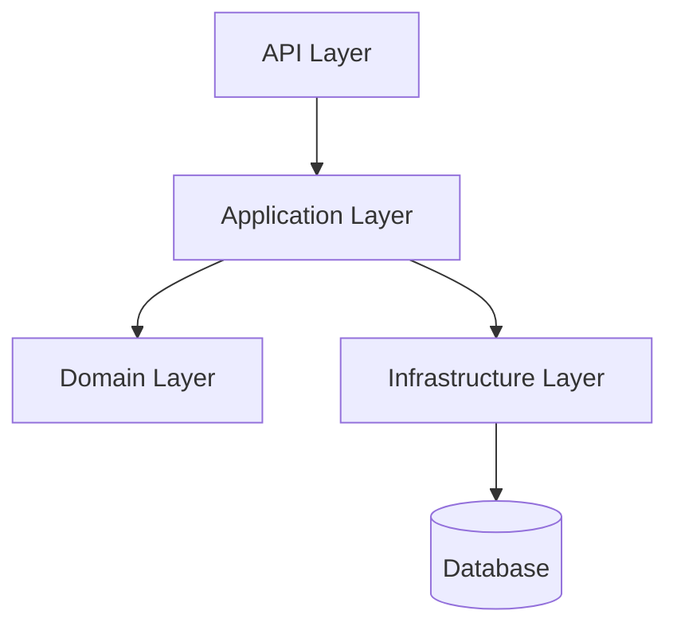
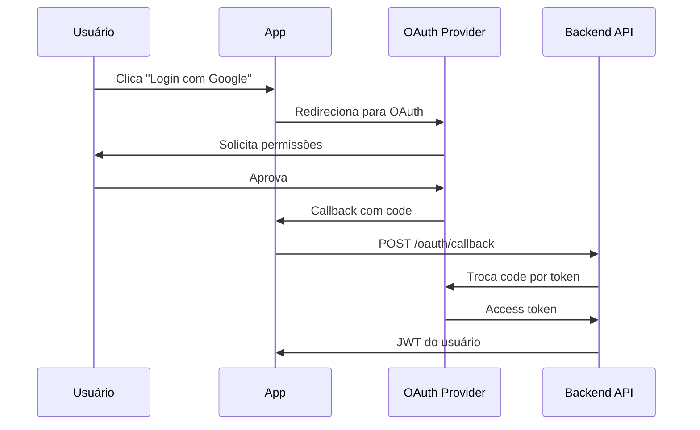
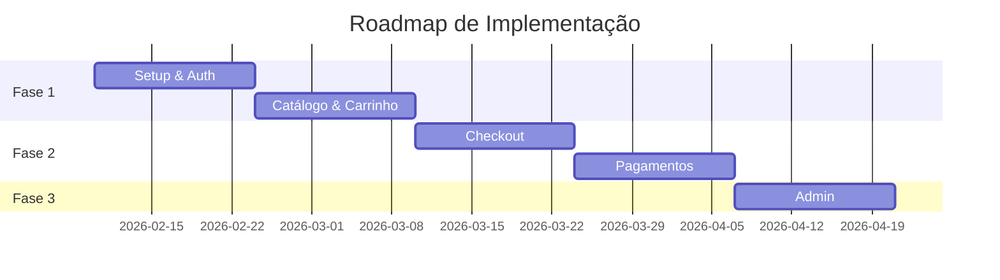

# MCP Prompts - Guided Workflows

Instruções pré-definidas para fluxos de documentação guiados.

## O que são Prompts MCP?

Prompts MCP são instruções especializadas que guiam o agente AI através de workflows complexos de documentação. Cada prompt:

- ✅ Define um papel específico para o agente (arquiteto, escriba, consultor)
- ✅ Fornece estrutura e templates para documentação
- ✅ Implementa guardrails anti-genérico
- ✅ Força análise de código real antes de documentar

## Prompts Disponíveis

### 1. /doc-project

**Objetivo:** Documentar estrutura e arquitetura completa do projeto.

**Papel:** Arquiteto e escriba técnico

**Uso no Cursor:**

```
"Use /doc-project para documentar a estrutura do projeto atual"
```

**Parâmetros:**

- `projectName` (opcional) - Nome do projeto
- `collectionId` (opcional) - Collection onde criar documento
- `focusAreas` (opcional) - Áreas específicas para focar

**O que o agente fará:**

1. Analisar estrutura de pastas em `src/`
2. Identificar padrões de design e arquitetura
3. Mapear dependências entre módulos
4. Gerar diagrama Mermaid de arquitetura
5. Criar documento completo no Outline

**Template usado:** `skills/project-documentation.md`

**Exemplo de saída:**

```markdown
# Project: Sistema de E-commerce

## Visão Geral

Sistema de e-commerce construído em .NET 8.0 com arquitetura em camadas.

## Estrutura de Pastas

- `src/Api/` - Camada de apresentação (REST API)
- `src/Application/` - Lógica de aplicação e casos de uso
- `src/Domain/` - Entidades de domínio e regras de negócio
- `src/Infrastructure/` - Acesso a dados e serviços externos

## Arquitetura



## Tecnologias

- ASP.NET Core 8.0
- Entity Framework Core
- PostgreSQL
- Redis (cache)

## Padrões de Design

- Repository Pattern
- CQRS (Command Query Responsibility Segregation)
- Dependency Injection
```

### 2. /doc-feature

**Objetivo:** Documentar implementação de funcionalidade específica.

**Papel:** Engenheiro técnico documentando feature

**Uso no Cursor:**

```
"Use /doc-feature para documentar a nova funcionalidade de autenticação OAuth"
```

**Parâmetros:**

- `featureName` (obrigatório) - Nome da funcionalidade
- `collectionId` (opcional) - Collection onde criar documento
- `parentDocumentId` (opcional) - Documento pai para hierarquia

**O que o agente fará:**

1. Analisar código relacionado à feature
2. Identificar componentes envolvidos
3. Documentar fluxo de execução
4. Gerar diagramas apropriados (sequência, fluxo)
5. Incluir exemplos de uso

**Template usado:** `skills/feature-documentation.md`

**Exemplo de saída:**

```markdown
# Feature: Autenticação OAuth 2.0

## Visão Geral

Implementação de autenticação via OAuth 2.0 suportando Google e GitHub.

## Componentes

- `OAuthController` - Endpoints de callback
- `OAuthService` - Lógica de autenticação
- `TokenProvider` - Geração de tokens JWT

## Fluxo de Autenticação



## Endpoints

- `GET /oauth/authorize?provider={google|github}`
- `GET /oauth/callback?code={code}&state={state}`

## Configuração

```json
{
  "OAuth": {
    "Google": {
      "ClientId": "...",
      "ClientSecret": "..."
    }
  }
}
```

## Testes

- `OAuthControllerTests.cs`
- `OAuthServiceTests.cs`
```

### 3. /get-budget

**Objetivo:** Criar proposta técnico-comercial com roadmap de implementação.

**Papel:** Especialista em arquitetura e pré-venda

**Uso no Cursor:**

```
"Use /get-budget para criar uma proposta técnico-comercial para o cliente Acme Corp"
```

**Parâmetros:**

- `clientName` (obrigatório) - Nome do cliente
- `projectName` (obrigatório) - Nome do projeto
- `collectionId` (opcional) - Collection onde criar documento
- `requirementsDocId` (opcional) - ID do documento de requisitos

**O que o agente fará:**

1. Analisar requisitos técnicos
2. Estimar complexidade por funcionalidade
3. Criar roadmap de entregas
4. Calcular horas por fase
5. Gerar proposta comercial estruturada

**Template usado:** `skills/budget-proposal.md`

**Exemplo de saída:**

```markdown
# Proposta: Sistema E-commerce - Acme Corp

## Cliente

**Acme Corp**  
Data: 2026-02-03  
Validade: 30 dias

## Sumário Executivo

Proposta para desenvolvimento de plataforma de e-commerce com:
- Catálogo de produtos
- Carrinho de compras
- Checkout e pagamentos
- Painel administrativo

## Escopo Técnico

### Fase 1: Core (Sprint 1-2) - 160h

| Item | Descrição | Horas |
|------|-----------|-------|
| Setup | Infraestrutura, CI/CD | 16h |
| Autenticação | Login, registro, JWT | 24h |
| Catálogo | Produtos, categorias | 40h |
| Carrinho | Adicionar, remover, calcular | 32h |
| API REST | Endpoints principais | 24h |
| Testes | Unitários e integração | 24h |

### Fase 2: Checkout (Sprint 3-4) - 120h

| Item | Descrição | Horas |
|------|-----------|-------|
| Checkout | Fluxo completo | 40h |
| Pagamentos | Integração Stripe | 32h |
| Pedidos | Gestão de pedidos | 24h |
| Notificações | Email, SMS | 16h |
| Testes | E2E | 8h |

### Fase 3: Admin (Sprint 5) - 80h

| Item | Descrição | Horas |
|------|-----------|-------|
| Dashboard | Métricas e KPIs | 24h |
| Gestão | CRUD de produtos | 32h |
| Relatórios | Vendas, estoque | 16h |
| Testes | Integração | 8h |

## Roadmap



## Investimento

| Fase | Horas | Valor |
|------|-------|-------|
| Fase 1 | 160h | R$ 32.000 |
| Fase 2 | 120h | R$ 24.000 |
| Fase 3 | 80h | R$ 16.000 |
| **Total** | **360h** | **R$ 72.000** |

*Valor hora: R$ 200*

## Equipe

- 2 desenvolvedores full-stack
- 1 tech lead
- 1 QA

## Premissas

- Cliente fornecerá credenciais de APIs externas
- Infraestrutura em cloud (AWS/Azure)
- Sprints de 2 semanas
- Reuniões semanais de alinhamento

## Entregáveis

- Código fonte
- Documentação técnica
- Testes automatizados
- Deploy em produção
- Treinamento da equipe

## Próximos Passos

1. Aprovação da proposta
2. Kickoff meeting
3. Início da Fase 1
```

### 4. /quick-start

**Objetivo:** Executar bootstrap completo do MCP Integration.

**Papel:** Assistente de setup e configuração

**Uso no Cursor:**

```
"Use /quick-start para executar o bootstrap completo"
```

**O que o agente fará:**

1. Verificar estrutura do workspace atual
2. Ler documentação em `docs/` e templates em `skills/`
3. Criar collections "MCP" e "Outline Skills" se necessário
4. Copiar templates para "Outline Skills"
5. Criar documentação inicial do projeto
6. Validar todas as ferramentas MCP

**Guardrails Implementados:**

- ⚠️ DEVE ler arquivos reais de `docs/` e `skills/`
- ⚠️ PROIBIDO criar conteúdo genérico ou placeholder
- ⚠️ Se arquivos não encontrados, reportar erro ao invés de inventar

**Nota:** Este prompt embute conteúdo completo de `docs/*.md` e `skills/*.md` para garantir documentação precisa.

## Guardrails Anti-Genérico

**⚠️ TODOS os prompts implementam proteções contra conteúdo genérico.**

### O que são Guardrails?

Guardrails são instruções explícitas nos prompts que **forçam** o agente AI a:

1. **Ler arquivos reais** do workspace antes de documentar
2. **Analisar código existente** ao invés de criar exemplos fictícios
3. **Reportar erros** quando arquivos não encontrados
4. **Proibir placeholders** como "TODO", "Exemplo", "Descrição aqui"

### Por que isso é importante?

**Sem guardrails:**
```markdown
# API Documentation

## Endpoints

### GET /api/users
Retorna lista de usuários.

**Example Response:**
```json
{
  "users": [
    {"id": 1, "name": "Exemplo"}
  ]
}
```
```

❌ **Problema:** Conteúdo genérico, não reflete a API real.

**Com guardrails:**
```markdown
# API Documentation

## Endpoints

### GET /api/users

Retorna lista de usuários com paginação. Implementado em `UserController.cs` linha 42.

**Parâmetros:**
- `page` (int, opcional) - Número da página (default: 1)
- `pageSize` (int, opcional) - Tamanho da página (default: 20)

**Autenticação:** Requer JWT token

**Response Real (de UserController.GetUsers):**
```json
{
  "data": [...],
  "pagination": {
    "currentPage": 1,
    "totalPages": 5,
    "totalItems": 100
  }
}
```

**Modelo:** `UserDto` definido em `Models/UserDto.cs`
```

✅ **Solução:** Documentação precisa baseada no código real.

### Exemplo de Guardrail

```markdown
## CRITICAL GUARDRAILS

⚠️ DO NOT create generic/placeholder content
⚠️ MUST read actual files from the workspace before documenting
⚠️ If files not found, report error - don't invent content
⚠️ MUST analyze real code structure, not create examples
⚠️ MUST use actual class names, methods, and endpoints from codebase
```

### Benefícios

- ✅ Documentação sempre precisa e atualizada
- ✅ Reduz documentação desatualizada (rot)
- ✅ Força análise do código ao invés de suposições
- ✅ Mantém consistência com implementação real

## Customização de Templates

Os templates são **embedded** no executável, mas você pode customizá-los no Outline:

1. Execute o bootstrap para criar collection "Outline Skills":
   ```bash
   dotnet run --project src/Outline.Mcp.Client -- bootstrap
   ```

2. Acesse a collection "Outline Skills" no Outline

3. Edite os 3 templates conforme necessário:
   - ProjectDocumentation
   - FeatureDocumentation
   - BudgetProposal

4. Os prompts MCP irão buscar primeiro na collection "Outline Skills"

5. Se não encontrarem no Outline, usam templates embedded como fallback

**Nota:** Templates embedded garantem funcionamento mesmo sem customização prévia.

## Best Practices

### 1. Use o Prompt Apropriado

| Cenário | Prompt |
|---------|--------|
| Novo projeto | `/doc-project` |
| Nova feature | `/doc-feature` |
| Proposta comercial | `/get-budget` |
| Setup inicial | `/quick-start` |

### 2. Forneça Contexto

**Ruim:**
```
"Use /doc-feature"
```

**Bom:**
```
"Use /doc-feature para documentar a funcionalidade de autenticação OAuth 
implementada em src/Auth/, focando no fluxo de callback e geração de tokens"
```

### 3. Especifique Collection

```
"Use /doc-project para documentar o projeto na collection 'Engineering'"
```

### 4. Aproveite Hierarquia

```
"Use /doc-feature para documentar a feature de pagamentos,
criando como sub-documento do 'E-commerce Overview'"
```

## Troubleshooting

### Prompt criou conteúdo genérico

**Causa:** Guardrails falharam ou arquivos não foram encontrados.

**Solução:**
1. Verifique se `docs/` e `skills/` existem no projeto
2. Para Docker SSE: confirme que Dockerfile copia essas pastas
3. Para executável: rode script de publish para incluir documentação
4. Reexecute o prompt com contexto mais específico

### Template não encontrado

**Causa:** Arquivo não existe em `skills/` ou collection "Outline Skills".

**Solução:**
```bash
# Verifique arquivos locais
ls skills/

# Execute bootstrap para criar collection
dotnet run --project src/Outline.Mcp.Client -- bootstrap \
  --collection-id "your-collection-id"
```

### Documentação incompleta

**Causa:** Prompt não encontrou arquivos específicos.

**Solução:** Especifique caminhos explícitos:

```
"Use /doc-feature para documentar OAuth,
analisando especificamente:
- src/Auth/OAuthController.cs
- src/Auth/OAuthService.cs
- src/Auth/TokenProvider.cs"
```

## Próximos Passos

- [Ferramentas MCP](./mcp-tools.md) - Tools individuais
- [Revisões](./revisions.md) - Sistema de histórico
- [CLI](./cli.md) - Uso via terminal
