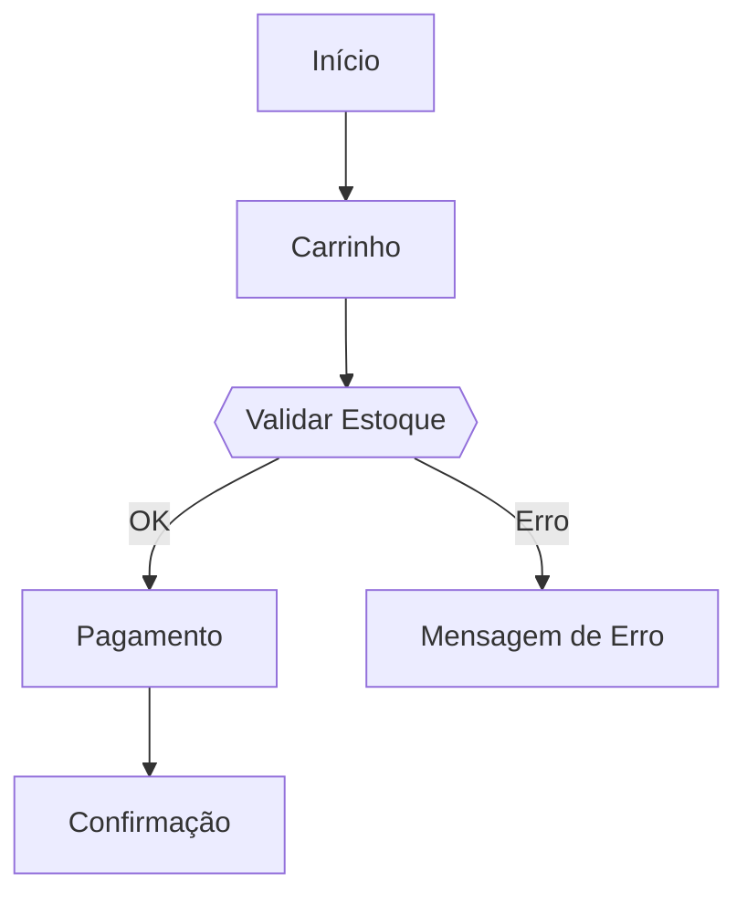
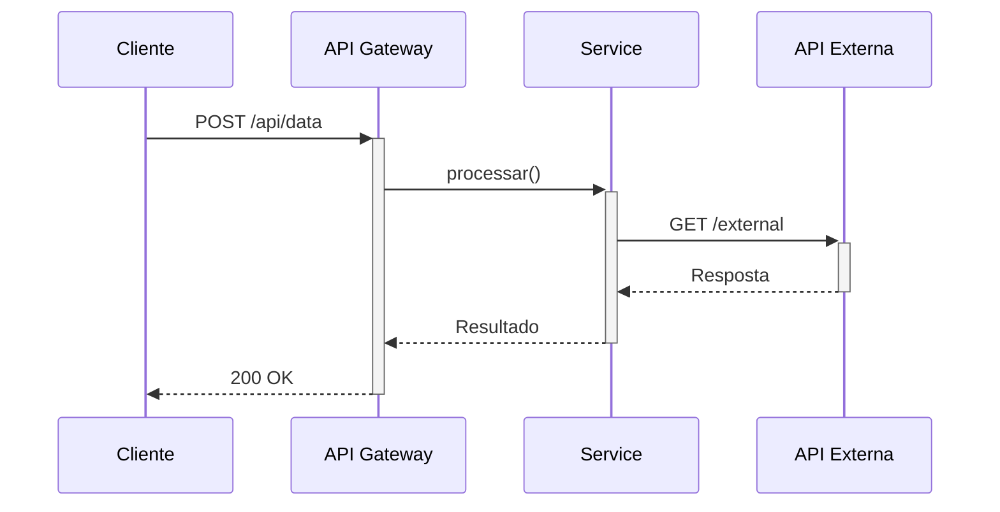
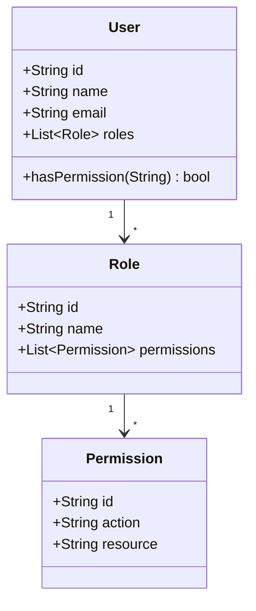

# MCP Tools - AI Agent Usage

Guia para usar as ferramentas MCP com Cursor e Claude Desktop.

## Pré-requisitos

- MCP Server configurado (veja [guia de setup](../setup/))
- Cursor ou Claude Desktop instalado
- `mcp.json` configurado corretamente

## Ferramentas Disponíveis

### Documentos

| Tool | Descrição | Parâmetros |
|------|-----------|------------|
| `list_collections` | Lista collections disponíveis | Nenhum |
| `search_documents` | Busca documentos por query | query, collectionId (opcional), limit |
| `get_document` | Obtém documento específico | documentId |
| `create_document` | Cria novo documento | title, text, collectionId, icon (opcional) |
| `update_document` | Atualiza documento existente | documentId, title (opcional), text (opcional), append |
| `delete_document` | Remove documento | documentId, permanent |

### Revisões

| Tool | Descrição | Parâmetros |
|------|-----------|------------|
| `list_revisions` | Lista histórico de revisões | documentId |
| `get_revision` | Obtém conteúdo de revisão | revisionId |
| `restore_revision` | Restaura documento | documentId, revisionId, collectionId (opcional) |

## Uso no Cursor

### Exemplos de Prompts Básicos

**Listar collections:**

```
"Liste todas as collections disponíveis no Outline"
```

O Cursor irá:
1. Solicitar permissão para executar `list_collections`
2. Executar a tool
3. Apresentar os resultados formatados

**Buscar documentos:**

```
"Busque documentos sobre autenticação no Outline e resuma os resultados"
```

**Obter documento específico:**

```
"Mostre-me o conteúdo do documento 'API Reference' no Outline"
```

### Exemplos Avançados

**Criar documentação de classe:**

```
"Analise a classe UserService em src/Services/UserService.cs 
e crie um documento no Outline na collection 'Engineering' 
documentando seus métodos, dependências e casos de uso"
```

O Cursor irá:
1. Ler o arquivo `UserService.cs`
2. Analisar a estrutura da classe
3. Executar `create_document` com:
   - Título: "UserService Documentation"
   - Texto: Documentação completa gerada
   - Collection: Engineering
   - Icon: BOOK

**Atualizar documentação existente:**

```
"Atualize o documento 'API Reference' no Outline adicionando 
documentação para os novos endpoints REST em src/Controllers/"
```

O Cursor irá:
1. Buscar o documento "API Reference"
2. Ler os controllers em `src/Controllers/`
3. Gerar documentação dos novos endpoints
4. Executar `update_document` com append

**Criar diagrama de arquitetura:**

```
"Analise a arquitetura do projeto em src/ e crie um documento 
no Outline com diagrama Mermaid mostrando:
- Estrutura de camadas
- Dependências entre módulos
- Fluxo de dados principal"
```

O Cursor irá:
1. Analisar estrutura em `src/`
2. Gerar diagrama Mermaid apropriado
3. Criar documento com descrição e diagrama

### Workflows Combinados

**Documentar feature completa:**

```
"Para a funcionalidade de autenticação OAuth:
1. Crie documento 'OAuth Implementation' com visão geral
2. Documente o fluxo com diagrama de sequência Mermaid
3. Liste todos os endpoints relacionados
4. Inclua exemplos de request/response"
```

**Sincronizar docs:**

```
"Busque o documento 'Setup Guide' no Outline,
compare com docs/SETUP.md local,
e atualize o documento no Outline com as mudanças locais"
```

**Gerar changelog:**

```
"Analise os commits desde a última tag,
crie documento 'Changelog v1.2.0' no Outline
na collection 'Releases' com:
- Novos recursos
- Correções
- Breaking changes"
```

## Uso com Claude Desktop

Similar ao Cursor, use linguagem natural:

```
"Crie documentação completa da classe UserService no Outline"
```

```
"Analise o código de autenticação e crie um diagrama de sequência 
no Outline mostrando o fluxo completo"
```

## Uso com Revisões

**Listar histórico:**

```
"Liste todas as revisões do documento 'API Reference' no Outline"
```

**Ver revisão específica:**

```
"Mostre o conteúdo da revisão anterior do documento 'API Reference'"
```

**Restaurar versão:**

```
"Restaure o documento 'API Reference' para a revisão de ontem"
```

## Diagramas Mermaid

Os agentes AI podem gerar automaticamente diagramas Mermaid apropriados.

### Flowcharts

```
"Crie fluxograma do processo de checkout no Outline"
```

**Resultado:**



### Sequence Diagrams

```
"Documente a integração com API externa usando diagrama de sequência"
```

**Resultado:**



### Class Diagrams

```
"Crie diagrama de classes mostrando o relacionamento entre User, Role e Permission"
```

**Resultado:**



## Best Practices

### 1. Seja Específico nos Prompts

**Ruim:**
```
"Documente o projeto"
```

**Bom:**
```
"Crie documento 'Architecture Overview' no Outline na collection 'Engineering' 
descrevendo:
- Estrutura de pastas em src/
- Padrões de design utilizados
- Fluxo de dados principal
- Tecnologias e frameworks
Inclua diagrama Mermaid da arquitetura de camadas"
```

### 2. Especifique a Collection

**Ruim:**
```
"Crie documentação da API"
```

**Bom:**
```
"Crie documentação da API na collection 'Engineering'"
```

### 3. Use Icons Apropriados

Sugira icons nos prompts:

```
"Crie release notes na collection 'Releases' com icon CHANGELOG"
```

### 4. Organize por Tópicos

Para documentação grande, crie múltiplos documentos:

```
"Crie 3 documentos separados no Outline:
1. 'API Overview' - visão geral e convenções
2. 'API Authentication' - detalhes de autenticação
3. 'API Endpoints' - lista completa de endpoints"
```

### 5. Aproveite Context do Workspace

O agente tem acesso ao workspace inteiro:

```
"Analise TODOS os arquivos em src/Services/ 
e crie índice de documentação no Outline 
listando cada serviço com:
- Responsabilidade
- Dependências
- Métodos públicos principais"
```

## Limitações

### Rate Limiting

O Outline API limita requisições:
- **Limite:** 1000 requests/minuto
- **Comportamento:** Retorna 429 se exceder
- **Solução:** O cliente implementa retry automático

Para operações em lote, o agente AI fará pausa entre requests.

### Tamanho de Documento

Documentos muito grandes podem ter performance reduzida:
- **Recomendado:** < 500KB
- **Máximo:** ~1MB
- **Solução:** Divida em múltiplos documentos

### Concurrent Updates

Evite atualizar o mesmo documento simultaneamente:

```
# Ruim (se executados ao mesmo tempo)
Prompt 1: "Atualize 'API Docs' adicionando seção Auth"
Prompt 2: "Atualize 'API Docs' adicionando seção Errors"

# Bom (sequencial ou documento único)
"Atualize 'API Docs' adicionando seções Auth e Errors"
```

## Troubleshooting

### Tools não aparecem no Cursor

**Verificação:**

1. Confirme que `mcp.json` está correto
2. Use caminho absoluto para executável/.csproj
3. Reinicie o Cursor completamente
4. Verifique logs do Cursor (Help → Toggle Developer Tools → Console)

### Erro "Permission denied"

**Causa:** Tool requer aprovação do usuário.

**Solução:** O Cursor solicitará permissão antes de executar. Aprove para continuar.

### Resposta lenta

**Causa:** Documento muito grande ou rede lenta.

**Solução:**
- Divida documentos grandes
- Use buscas com limit: `--limit 10`
- Verifique latência com Outline

### Mermaid não renderiza

**Causa:** Sintaxe incorreta ou recursos não suportados.

**Solução:**
- Use sintaxe padrão Mermaid
- Evite features avançadas (clicks, estilos customizados)
- Teste em https://mermaid.live/ primeiro

## Próximos Passos

- [Prompts MCP](./mcp-prompts.md) - Instruções pré-definidas
- [Revisões](./revisions.md) - Sistema de histórico
- [CLI](./cli.md) - Uso via terminal
